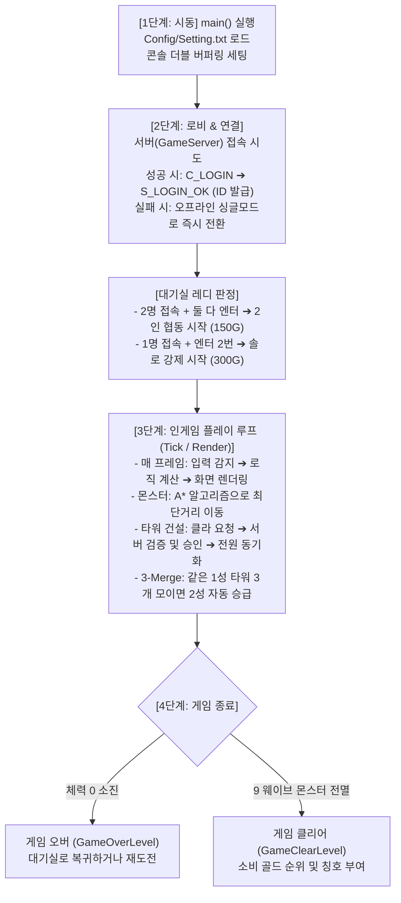

# 🎮 [초보자 필독] 콘솔 게임 프로젝트 & SK Defense 동작 흐름 완전 정복 가이드

본 문서는 프로그래밍이나 게임 서버를 처음 접하는 초보자도 **"프로그램이 켜져서 게임이 끝나기까지 도대체 무슨 일이 일어나는가?"**를 머릿속에 한 편의 영화처럼 쉽게 그릴 수 있도록 작성된 종합 입문 가이드입니다.

---

## 🧭 목차
1. [한눈에 보는 프로젝트 전체 구조 (누가 무슨 일을 하나요?)](#1-한눈에-보는-프로젝트-전체-구조)
2. [전체 실행 흐름 4단계 요약도](#2-전체-실행-흐름-4단계-요약도)
3. [1단계: 프로그램 시작과 엔진 시동 (Boot & Init)](#3-1단계-프로그램-시작과-엔진-시동)
4. [2단계: 대기실(로비)과 서버 네트워크 연결 (Lobby & Handshake)](#4-2단계-대기실로비과-서버-네트워크-연결)
5. [3단계: 본격적인 게임 플레이 루프 (In-Game Tick & Render)](#5-3단계-본격적인-게임-플레이-루프)
   - 3-1. 게임 루프의 3박자: 입력 ➔ 계산 ➔ 그리기
   - 3-2. 왜 타워를 지을 때 서버한테 먼저 물어볼까? (서버 권한형)
   - 3-3. 몬스터는 어떻게 길을 찾아갈까? (A* 길찾기 알고리즘)
   - 3-4. 터렛 3개가 모이면 합체! (3-Merge 시스템)
6. [4단계: 게임 클리어와 게임 오버 (Game End)](#6-4단계-게임-클리어와-게임-오버)
7. [초보자가 가장 헷갈리는 핵심 기술 3가지 쉬운 비유](#7-초보자가-가장-헷갈리는-핵심-기술-3가지-쉬운-비유)

---

## 1. 한눈에 보는 프로젝트 전체 구조

우리 프로젝트는 커다란 하나의 프로그램이 아니라, **각자 맡은 역할이 다른 4개의 서브 프로젝트**가 모여서 하나로 돌아갑니다.

| 서브 프로젝트 이름 | 비유 | 하는 일 |
| :--- | :--- | :--- |
| **`CraftEngine`** | **자동차의 엔진 프레임** | 화면에 글자 그리기, 키보드 입력 받기, 화면 깜빡임 없애기 등 모든 게임의 뼈대를 제공하는 순수 엔진 (DLL) |
| **`ServerCore`** | **우체국 & 고속도로 망** | 인터넷을 통해 데이터를 안전하고 빠르게 주고받는 초고속 통신 시스템 (Windows IOCP 기반 Lib) |
| **`SK_Defense_Server`** | **경기장의 심판 & 주최자** | 게임 방을 만들고, 플레이어들에게 ID를 주고, 몬스터 스폰 시간을 재며 "타워 지어도 됨!" 판정을 내리는 중앙 서버 |
| **`Project_SKDefense`** | **선수(플레이어)의 게임기** | 플레이어가 직접 조작하는 게임 클라이언트. 성큰 디펜스 맵을 띄우고 조작을 담당 |

---

## 2. 전체 실행 흐름 4단계 요약도



---

## 3. 1단계: 프로그램 시작과 엔진 시동

1. **`main.cpp` 실행**
   - 게임 프로그램이 켜지면 제일 먼저 `CraftEngine`을 깨웁니다.
2. **설정 파일 읽기 (`Config/Setting.txt`)**
   - 화면 가로 크기 120, 세로 크기 30, 초당 프레임 수(FPS) 120 등의 기본 설정을 읽어 콘솔 창 크기를 조절합니다.
3. **깜빡임 없는 화면 준비 (더블 버퍼링)**
   - 콘솔 창에서 글자를 지웠다 다시 쓰면 화면이 심하게 깜빡거립니다.
   - 그래서 **보이는 도화지(Front Buffer)**와 **그리는 중인 도화지(Back Buffer)** 2개를 준비해서, 다 그려지면 순간적으로 바꿔치기(Flip)하는 **더블 버퍼링 기술**을 켭니다.

---

## 4. 2단계: 대기실(로비)과 서버 네트워크 연결

게임을 켜면 가장 먼저 **`MainMenuLevel` (타이틀/로비 화면)**이 뜹니다.

```
┌───────────────────────────────────────────────────────────┐
│                     [ S K  D E F E N S E ]                │
│                                                           │
│                 Status: Connected to Server!              │
│                     Room Players: 1 / 2                   │
│                                                           │
│             [Enter] Press to Ready                        │
│             [Enter] Press again to start solo!            │
└───────────────────────────────────────────────────────────┘
```

1. **자동 접속 시도 (Handshake)**
   - 클라이언트는 켜지자마자 `127.0.0.1:7777`에 있는 전용 서버에 접속을 1회 노크합니다.
   - **서버가 꺼져 있다면?** 멈추지 않고 쿨하게 **오프라인 싱글모드**로 설정되어 혼자서 바로 게임을 즐길 수 있습니다.
   - **서버가 켜져 있다면?** `C_LOGIN_PACKET`을 서버로 전송합니다.
2. **서버의 신분증 발급**
   - 서버(`SK_Defense_Server`)는 접속한 클라이언트에게 원자적 번호 발급기(`std::atomic<uint32_t> nextPlayerId`)로 고유 ID(1번, 2번 등)를 뽑아 `S_LOGIN_OK_PACKET`으로 보내줍니다.
3. **게임 시작 조건 (스마트 레디 시스템)**
   - **2명이 모였을 때**: A 유저와 B 유저가 둘 다 [Enter]를 눌러 레디하면 서버가 즉시 `S_GAME_START`를 브로드캐스트하여 2인 협동 모드로 동시 진입합니다. (시작 골드: 각각 150G)
   - **혼자 테스트할 때**: [Enter]로 레디한 뒤 한 번 더 [Enter]를 누르면 `forceStart = true` 패킷이 날아가 혼자서 즉시 게임을 시작합니다. (시작 골드: 300G)

---

## 5. 3단계: 본격적인 게임 플레이 루프

게임이 시작되면 `DefenseLevel`로 씬이 전환되며, 컴퓨터는 1초에 수십~수백 번씩 아래의 **3박자 무한 루프**를 돕니다.

```
       ┌───────────────────────────────┐
       ▼                               │
  [1. Input] 키보드 / 마우스 입력 받기 │
       │                               │
       ▼                               │ (1초에 수십 번 반복)
  [2. Tick] 위치 이동, 충돌, 패킷 처리 │
       │                               │
       ▼                               │
  [3. Render] 콘솔 버퍼에 모아서 출력  │
       └───────────────────────────────┘
```

### 3-1. 타워 건설의 비밀: 왜 서버한테 먼저 물어볼까? (서버 권한형)
만약 내 컴퓨터(클라이언트)가 마음대로 "나 타워 지었어!" 하고 타워를 배치하면, 해커가 치트엔진으로 골드를 999999로 조작해서 타워를 무한대로 지을 수 있습니다.
이를 막기 위해 우리 게임은 **서버 권한형(Server-Authoritative)** 방식을 사용합니다:

1. **클라**: "서버님, 저 (10, 5) 위치에 50골드 내고 타워 짓고 싶어요!" (`C_BUILD_TURRET_PACKET`)
2. **서버**: "잠깐 기다려봐. (서버 장부를 확인하며) 너 지금 150골드 있네? 50골드 빼고 100골드로 깎을게. 승인!"
3. **서버**: 모든 플레이어에게 공지 ➔ "모두 주목! 1번 플레이어가 (10, 5)에 타워 지었으니 화면에 그려!" (`S_BUILD_TURRET_PACKET`)
4. **클라**: 서버의 승인 방송을 듣고 비로소 화면에 예쁜 타워를 뙇 짓습니다!

### 3-2. 몬스터는 어떻게 길을 찾아갈까? (A* 최단거리 알고리즘)
- 몬스터는 3개의 입구에서 소환되어 플레이어의 본진(기지)을 향해 걸어옵니다.
- 플레이어가 맵 곳곳에 타워를 지어 미로처럼 길을 막더라도, 몬스터는 **A* (A-Star) 알고리즘**을 사용해 타워를 요리조리 피하는 최단 경로를 실시간으로 계산해 전진합니다.
- 만약 플레이어가 타워로 몬스터가 아예 지나갈 수 없게 입구를 꽉 막아버리려고 하면? `CanBuildTurret()` 함수가 이를 사전에 감지하여 "길을 완전히 막을 수는 없습니다!" 하고 건설을 거부합니다.

### 3-3. 3-Merge 자동 승급 (합체!)
- 타워 디펜스의 백미! 같은 성급의 같은 속성 타워가 3개 모이면 자동으로 합체합니다.
  - 예: `1성 화염 타워` 3개 ➔ 펑! 소리와 함께 **`2성 화염 타워` 1개로 자동 승급**!
- 화염(범위 피해), 얼음(감속 슬로우), 전기(빠른 공속) 등 전략에 맞게 배치할 수 있습니다.

---

## 6. 4단계: 게임 클리어와 게임 오버

### 💀 기지 체력이 0이 되었을 때 (Game Over)
- 몬스터가 방어선을 뚫고 기지에 닿아 라이프가 모두 소모되면:
- 서버 또는 클라이언트가 게임 오버를 선언하고 `GameOverLevel` 화면을 띄웁니다.
- 엔터를 누르면 맵 잔해와 메모리를 완전히 새것으로 청소(`RestartDefenseLevel`)하고 대기실로 돌아옵니다.

### 👑 9 웨이브를 모두 막아냈을 때 (Game Clear)
- 총 9단계의 웨이브가 진행됩니다:
  - **1~3 웨이브**: 입구 1개 오픈
  - **4~6 웨이브**: 입구 2개 오픈
  - **7~9 웨이브**: 입구 3개 전체 오픈 (지옥의 난이도!)
- 9 웨이브의 모든 몬스터를 처치하면 영광의 **`GameClearLevel`**로 이동합니다!
- 여기서 서버는 게임 동안 **"누가 골드를 가장 많이/효율적으로 썼는지"**를 집계하여 1위, 2위 랭킹과 함께 맞춤형 칭호(예: `Tycoon Defender`, `Efficient Strategist`)를 수여합니다.

---

## 7. 초보자가 가장 헷갈리는 핵심 기술 3가지 쉬운 비유

### ① IOCP (I/O Completion Port)
- **일반 소켓 프로그래밍**: 손님이 올 때까지 주방장이 문 앞만 멍하니 쳐다보고 서 있는 것 (비효율의 극치).
- **IOCP 방식**: 손님이 주문서를 넣으면 "딩동~" 하고 알림 벨이 울리는 스마트 오더 시스템. 주방장(워커 스레드)들은 평소에 쉬거나 다른 일을 하다가, 알림 벨이 울릴 때만 주문서(패킷)를 집어서 잽싸게 요리합니다.

### ② 패킷 조각(Fragmentation)과 RecvBuffer
- TCP는 데이터를 택배 박스가 아니라 **수도꼭지에서 나오는 물줄기(스트림)**처럼 보냅니다.
- 패킷이 반으로 쪼개져서 오거나 2개가 뭉쳐서 올 수 있습니다.
- `RecvBuffer`는 이를 해결하기 위해 **계량컵** 역할을 합니다.
  - 헤더(크기표)를 먼저 보고 "어? 20바이트짜리 패킷인데 아직 10바이트밖에 안 왔네?" 하면 안 건드리고 물이 더 찰 때까지 기다렸다가 완벽한 한 잔이 채워지면 그때 마십니다.

### ③ 뮤텍스 락 (`lock_guard<std::mutex>`)
- 게임방(`GameRoom`)은 **"열쇠가 하나뿐인 1인용 화장실"**입니다.
- 1번 스레드가 방 정보를 수정하러 들어갈 때 문을 잠급니다.
- 2번 스레드가 도착하면 문 밖에서 0.001초 동안 얌전히 기다립니다.
- 1번 스레드가 볼일을 다 보고 나오면(함수 종료 시 락 해제), 2번 스레드가 들어가서 안전하게 작업을 수행합니다. 덕분에 데이터가 꼬이거나 충돌하는 일이 없습니다.

---

> 💡 **작성일**: 2026-09-07  
> 📁 **위치**: `Docs/PROJECT_FLOW_BEGINNER_GUIDE.md`  
> 📌 **프로젝트**: ConsoleGameProject (SK Defense)
